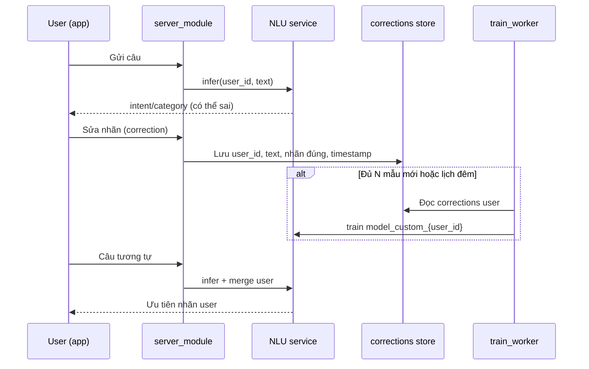

# Kiến trúc triển khai — NLU + server_module + học theo user

Tài liệu chốt luồng để triển khai production. Nguồn yêu cầu sản phẩm: [`cần sửa.md`](cần%20sửa.md).  
Code NLU hiện tại: repo `Train` (`src/nlu/`, `src/api/app.py`). Backend app: **`server_module`** (triển khai riêng).

**Cập nhật:** 2026-05 · Phase NLU text đã đóng · P3 (user learning, action popup) + OCR là bước sau.

---

## 1. Nguyên tắc chốt

| # | Quyết định |
|---|------------|
| 1 | **NLU + train + model global** nằm trên **server** (service hoặc module), không nhét PhoBERT full lên mobile. |
| 2 | **Một bộ model global** (`text_nlu/models/`) phục vụ mọi user; inference **stateless** theo `text` (+ `profile` cho NLG). |
| 3 | **Cá nhân hoá** = dữ liệu correction theo `user_id` + **`model_custom`** (hoặc lookup) trên server — không phải mỗi user một server. |
| 4 | **Chitchat** tone/story: **Gemini/LLM** trên server; không train sentiment PhoBERT. |
| 5 | **Giao dịch, popup Action, admin** thuộc **`server_module` + DB**; NLU chỉ trả structured output. |
| 6 | Mobile = client mỏng: gửi text/ảnh, hiển thị kết quả, gửi correction & xác nhận Action. |

---

## 2. Sơ đồ tổng thể

```
┌─────────────────┐     HTTPS      ┌──────────────────────────────────────────┐
│  Mobile / Web   │ ─────────────► │           server_module (BE)              │
│  - nhập text    │                │  Auth, user_id, DB giao dịch/báo cáo    │
│  - OCR ảnh      │                │  Action popup / confirmed_actions       │
│  - sửa nhãn     │                │  Corrections API → lưu CSV/DB per user  │
│  - xác nhận Act │                │  Admin queue (nhãn sai, rejected)     │
└─────────────────┘                └───────────────┬────────────────────────────┘
                                                 │ HTTP nội bộ (hoặc import lib)
                                                 ▼
                                 ┌──────────────────────────────────────────┐
                                 │  NLU service (repo Train / src + text_nlu) │
                                 │  POST /infer { user_id, text, profile }    │
                                 │  - model GLOBAL (load 1 lần)               │
                                 │  - model USER (optional, merge)            │
                                 │  - Gemini NLG (Chitchat / run_llm)         │
                                 └──────────────────────────────────────────┘
```

**OCR (phase sau):** ảnh → `server_module` → OCR service → `text` → cùng luồng `/infer`.

---

## 3. Luồng inference chuẩn (đã có + mục tiêu)

### 3.1 Hiện tại (repo Train)

```
POST /infer
  body: { "text", "profile"?, "run_llm"?, "emotion"? }
  → run_nlu(global models)
  → build_context_metadata(profile)
  → attach_nlg_and_llm (Chitchat / run_llm)
  → JSON
```

- Model load **một lần** khi start: `src/api/app.py` (INTENT_MODEL, CATEGORY_MODEL, …).
- **Chưa có** `user_id`, **chưa có** `model_custom`.

### 3.2 Mục tiêu (khi gắn server_module)

```
POST /api/chat/infer   (server_module — public)
  → xác thực JWT/session → user_id
  → gọi NLU nội bộ với user_id

POST /infer            (NLU service — nội bộ)
  body: {
    "user_id": "uuid",
    "text": "ăn phở 45k",
    "profile": { budget_remain, ... },
    "run_llm": true
  }
  → result_global = run_nlu(text, GLOBAL_*)
  → result = merge_user(user_id, text, result_global)   // TASK-08
  → nếu intent == Action → server_module quyết popup   // TASK-09
  → attach_nlg_and_llm(...)
```

---

## 4. Nhiều user cùng lúc — xử lý thế nào?

NLU **không** gắn session trong model. Mỗi request độc lập; model **dùng chung** trong RAM.

| Thành phần | Cách scale |
|------------|------------|
| TF-IDF + joblib | Nhiều worker, CPU ổn |
| PhoBERT encoder | Nặng CPU/GPU; tăng worker hoặc 1 GPU + queue |
| Gemini | Rate limit API; queue / cache; tách service LLM |
| DB / correction | PostgreSQL (khuyến nghị), không chỉ CSV khi > vài nghìn user |

**Triển khai gợi ý:**

- `uvicorn src.api.app:app --workers 2` (mỗi worker ~1 bản copy model → RAM × N).
- Hoặc **1 NLU container** + load balancer; **server_module** nhiều instance nhẹ hơn.
- **Không** set `os.environ["RUN_LLM"]` theo request (race giữa user) — truyền `run_llm` vào hàm (refactor nhỏ khi triển khai).

**Rate limit:** theo `user_id` ở server_module (ví dụ 60 infer/phút/user).

---

## 5. TASK-08 — Học riêng từng user (`model_custom`)

> Yêu cầu [`cần sửa.md`](cần%20sửa.md) dòng 1 + 3.

### 5.1 Luồng người dùng



### 5.2 Lưu correction

**Giai đoạn 1 (đơn giản):** file CSV per user

```
data/users/{user_id}/corrections.csv
```

Cột đề xuất:

| Cột | Mô tả |
|-----|--------|
| `text` | Câu gốc |
| `intent` | Record \| Action \| Chitchat |
| `category` | Nếu Record |
| `type` | expense \| income |
| `label` | Category label (Food, …) |
| `action_type` | Nếu Action |
| `source` | `user` \| `admin` \| `ai_suggest` |
| `created_at` | ISO datetime |
| `predicted` | JSON snapshot NLU lúc sai (optional) |

**Giai đoạn 2:** bảng `user_corrections` trên PostgreSQL (cùng server_module).

### 5.3 Chiến lược merge khi infer (ưu tiên nhãn user)

Thứ tự áp dụng (từ mạnh → yếu):

1. **Exact match** — `text` đã có trong `corrections.csv` → trả nhãn đã lưu (tuyệt đối ưu tiên).
2. **User model** — nếu tồn tại `models/users/{user_id}/` và confidence cao hơn global + margin (ví dụ +0.15).
3. **Global model** — `run_nlu` như hiện tại.

**Train `model_custom` (gợi ý kỹ thuật):**

| Mức | Cách | Khi nào |
|-----|------|---------|
| A | Chỉ lookup exact/fuzzy | < 20 correction |
| B | User logistic trên embedding PhoBERT (intent/category) | 50–500 correction |
| C | Full retrain mini bundle per user | power user, admin yêu cầu |

Script đề xuất (chưa có — implement TASK-08):

```
text_nlu/train/train_user_models.py --user-id <uuid>
```

Đầu ra:

```
text_nlu/models/users/{user_id}/
  intent_encoder.joblib   (optional)
  category_model.joblib   (optional)
  meta.json               (version, n_samples, trained_at)
```

**Global model không đổi** khi 1 user correction — chỉ train lại user bundle.

### 5.4 Admin & AI gán nhãn

| Kênh | Luồng |
|------|--------|
| **Admin** | Dashboard server: hàng đợi `rejected_actions` + infer sai → admin gán nhãn → ghi `corrections` với `source=admin` → train user hoặc merge vào global (hiếm). |
| **User mô tả** | User gửi: «Câu này là tiền mẹ cho, không phải chi tiêu» → server gọi Gemini **labeling** (không phải chitchat) → đề xuất nhãn → user confirm → lưu correction → train. |

API đề xuất (server_module):

```
POST /api/corrections          { text, intent, category?, ... }
POST /api/corrections/ai-label { text, user_description }  → suggested labels
GET  /api/admin/corrections?status=pending
POST /api/admin/corrections/{id}/resolve
```

---

## 6. TASK-09 — Action: popup & nhớ xác nhận

> [`cần sửa.md`](cần%20sửa.md) dòng 2–3.

NLU trả `intent: Action`, `action_type`, `action_param`, … — **không** tự thực thi trên DB.

### 6.1 Luồng app

```
infer → Action
  → server_module: cần_confirm?
       - action_type chưa có trong user_confirmed_actions → popup
       - đã confirm trước đó → thực thi luôn
  → User Confirm
       → thực thi (SET_LIMIT, REPORT_GENERAL, …)
       → lưu user_confirmed_actions(user_id, action_signature)
  → User Reject / sai
       → KHÔNG lưu confirmed
       → log rejected → admin queue (TASK-08)
       → popup lỗi
```

**`action_signature`:** chuỗi chuẩn hoá, ví dụ `REPORT_GENERAL|tổng chi tháng này` hoặc hash pattern (không hash full text nếu có tham số động).

Bảng đề xuất (server_module DB):

```sql
user_confirmed_actions (user_id, action_signature, action_type, confirmed_at)
action_rejected_log     (user_id, text, predicted_json, rejected_at)
```

---

## 7. Mobile vs server — phân công

| Việc | Mobile | server_module | NLU (Train) |
|------|--------|---------------|-------------|
| UI nhập / OCR chụp | ✓ | | |
| Auth, user_id | token | ✓ | |
| `/infer` | gọi API | proxy | ✓ |
| Gemini key | ✗ | ✗ | ✓ (env server) |
| Lưu correction | gửi | ✓ DB/CSV | đọc khi train |
| Train model_custom | ✗ | trigger job | ✓ worker |
| Popup Action | UI | logic + DB | |
| Báo cáo / ghi chi | cache tạm | ✓ DB | |

---

## 8. API contract tham chiếu

### 8.1 NLU — hiện có

`POST /infer` (FastAPI `src/api/app.py`)

**Request:**

```json
{
  "text": "tổng chi tháng này",
  "profile": {
    "budget_total": 1000000,
    "budget_remain": 150000
  },
  "run_llm": true,
  "emotion": "hai_huoc"
}
```

**Response (rút gọn):**

```json
{
  "intent": "Action",
  "action_type": "REPORT_GENERAL",
  "intent_confidence": 0.92,
  "nlg_prompt": { "system": "...", "user": "..." },
  "gemini_json": { "story": "...", "status": "trung_lap" }
}
```

### 8.2 NLU — mở rộng (TASK-08)

```json
{
  "user_id": "550e8400-e29b-41d4-a716-446655440000",
  "text": "me cho 1tr",
  "profile": {},
  "run_llm": false
}
```

**Response thêm:**

```json
{
  "intent_source": "global|user_exact|user_model",
  "user_model_version": "2026-05-18T12:00:00Z"
}
```

### 8.3 server_module — public (đề xuất)

| Method | Path | Mô tả |
|--------|------|--------|
| POST | `/api/v1/infer` | Proxy NLU + profile từ DB user |
| POST | `/api/v1/corrections` | User gán lại nhãn |
| POST | `/api/v1/actions/confirm` | Xác nhận Action |
| POST | `/api/v1/actions/reject` | Từ chối → log admin |
| GET | `/api/v1/actions/pending-confirm` | Cần popup? |

---

## 9. Cấu trúc thư mục đề xuất (sau khi triển khai đủ)

```
Train/                          # NLU + train (repo hiện tại)
  src/nlu/pipeline.py
  src/api/app.py
  text_nlu/models/              # GLOBAL
  text_nlu/models/users/{id}/   # TASK-08 (tạo sau)
  text_nlu/datasets/            # train global only

server_module/                  # BE app (repo riêng)
  api/
  db/
  services/nlu_client.py        # gọi Train /infer
  services/correction_service.py
  services/action_confirm.py
  workers/train_user_model.py

data/                           # hoặc volume mount
  users/{user_id}/corrections.csv
```

---

## 10. Map TASK ↔ tài liệu

| TASK | Nội dung | Tài liệu |
|------|----------|----------|
| P2 API Gemini | Đã xong | §3.1, `command.md` |
| **TASK-08** | Correction + model_custom | §5 |
| **TASK-09** | Popup Action + nhớ | §6 |
| **TASK-10** | NER PRODUCT | OCR/NER phase, ngoài doc này |
| **TASK-OCR** | ảnh → text → infer | §2, `TASK.MD` |

---

## 11. Thứ tự triển khai đề xuất

```
1. server_module: auth + user_id + proxy POST /infer (profile từ DB)
2. Rate limit + workers NLU
3. TASK-09: confirmed_actions + popup API (không cần model_custom)
4. TASK-08 phase A: corrections CSV + exact match khi infer
5. TASK-08 phase B: train_user_models.py + merge confidence
6. Admin queue + AI label (Gemini)
7. TASK-OCR: /infer-image
```

---

## 12. Trạng thái repo Train (checklist nhanh)

| Hạng mục | Trạng thái |
|----------|------------|
| Global NLU + `/infer` + LLM | ✓ |
| `user_id` trên `/infer` | ✗ cần làm |
| `models/users/{id}/` | ✗ cần làm |
| Corrections API | ✗ (server_module) |
| Action confirm DB | ✗ (server_module) |
| Guard `action_query` / `income_phrase` | ✓ tạm (tắt được bằng env) |

**Env liên quan:** `command.md` mục 5–6 · Train: `USE_ACTION_QUERY_GUARD`, `USE_INCOME_PHRASE_GUARD`.

---

## 13. Tài liệu liên quan

| File | Nội dung |
|------|----------|
| [`cần sửa.md`](cần%20sửa.md) | Yêu cầu gốc sản phẩm |
| [`command.md`](command.md) | Lệnh train/demo |
| [`TASK.MD`](TASK.MD) | Checklist task |
| [`src/api/app.py`](src/api/app.py) | API NLU hiện tại |
| [`src/nlu/pipeline.py`](src/nlu/pipeline.py) | `run_nlu` |

---

*Tài liệu này là bản chốt luồng; khi implement TASK-08/09, cập nhật §12 và link PR/commit vào đây.*
