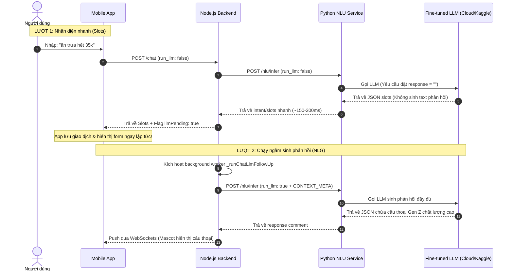

# Luồng Xử Lý NLU/NLG Hợp Nhất Với LLM Fine-tune (PhoGPT/Vistral)

Tài liệu này mô tả chi tiết kiến trúc và luồng xử lý mới sử dụng một mô hình LLM tinh chỉnh (Fine-tuned LLM) duy nhất cho cả hai nhiệm vụ **NLU (Nhận diện ý định & trích xuất Slots)** và **NLG (Sinh câu phản hồi Gen Z)**.

---

## 1. Thiết Kế Luồng 2-Pass Trả Dữ Liệu Nhanh (Non-blocking Flow)

Để tối ưu hóa trải nghiệm người dùng (UX) trên ứng dụng di động (hiển thị form giao dịch lập tức mà không phải chờ LLM sinh văn bản mất 1-2 giây), hệ thống áp dụng luồng xử lý chia làm 2 lượt (2 passes):



---

## 2. Cấu Trúc Dataset Huấn Luyện (`phogpt_finetune.jsonl`)

Tệp dữ liệu huấn luyện SFT (Supervised Fine-Tuning) bắt buộc phải giữ cấu trúc **cả hai trường `prompt` và `response`** để mô hình Causal LM học ánh xạ đầu vào - đầu ra.

### Định dạng từng dòng (JSONL):
*   **`prompt`**: Chứa thông tin ngữ cảnh hệ thống (`CONTEXT_META`) và câu nói của người dùng.
*   **`response`**: Chứa toàn bộ chuỗi JSON đích mà mô hình cần sinh ra (bao gồm cả intent, slots và câu thoại phản hồi).

```json
{
  "prompt": "Ngữ cảnh hệ thống (CONTEXT_META): {\"time_of_day\": \"trưa\", \"weather\": \"nắng\", \"wallet_health\": \"tốt\", \"days_to_payday\": 5}\nCâu thoại của người dùng: Ăn trưa hết 35k",
  "response": "{\"intent\": \"Record\", \"action_type\": null, \"slots\": {\"category\": \"Food\", \"amount\": 35000}, \"emotion\": \"happy\", \"response\": \"Trưa nắng nóng làm bát phở 35k là chuẩn bài rồi fen ơi, ví còn dày cứ triển đi!\"}"
}
```

> [!IMPORTANT]
> Bạn **bắt buộc phải giữ trường `response` ở lớp ngoài cùng của file `.jsonl`** vì đây là nhãn đích (target label) để mô hình học. Nếu bỏ trường này, mô hình sẽ không có dữ liệu để tối ưu hóa trọng số.

---

## 3. Cơ Chế Điều Hướng `run_llm` Trong Mã Nguồn

Hệ thống tự động điều khiển hành vi sinh từ của LLM thông qua Prompt thông minh tùy thuộc vào tham số `run_llm`:

### Lượt 1: `run_llm = False`
Hệ thống sử dụng prompt tối giản để hướng dẫn mô hình không sinh câu thoại nhằm đạt tốc độ phản hồi tối đa:
> *"Bạn là Mimo... Hãy phân tích ý định người dùng và trả về JSON... **TUYỆT ĐỐI đặt trường 'response' là chuỗi rỗng \"\" và không viết câu phản hồi.**"*

### Lượt 2: `run_llm = True`
Hệ thống nạp toàn bộ ngữ cảnh thực tế và yêu cầu mô hình phát huy tối đa khả năng sinh ngôn từ cá tính:
> *"Bạn là Mimo... Hãy phân tích ý định người dùng và trả về JSON chứa đầy đủ cấu trúc bao gồm cả câu thoại phản hồi cá tính Gen Z."*

---

## 4. Quy Trình Huấn Luyện Và Merge Trọng Số (Kaggle)

Do kiến trúc của PhoGPT không tương thích với Unsloth, quá trình fine-tune và merge được thực hiện qua các bước sau trên GPU T4 của Kaggle:

### 4.1. Fine-tuning với QLoRA 4-bit
Mô hình nền được load ở dạng lượng hóa 4-bit (`BitsAndBytesConfig`) để vừa vặn bộ nhớ VRAM, sau đó áp dụng LoRA adapters lên các modules: `Wqkv`, `out_proj`, `up_proj`, `down_proj`.

### 4.2. Merge LoRA vào Base Model (Tránh Lỗi 4-bit)
> [!CAUTION]
> Không thể gọi trực tiếp lệnh `merge_and_unload()` trên mô hình lượng hóa 4-bit (sẽ gây lỗi `ValueError`). Quy trình chuẩn được lập trình trong script huấn luyện như sau:
> 1. Lưu LoRA adapters đã huấn luyện xuống đĩa (`phogpt_lora`).
> 2. Giải phóng mô hình 4-bit khỏi RAM/VRAM GPU.
> 3. Load lại Base Model ở chế độ **16-bit float** không lượng hóa.
> 4. Nạp LoRA adapters vào Base Model 16-bit này và gọi `merge_and_unload()` để lưu ra phiên bản model hoàn chỉnh cuối cùng (`phogpt_vismimo`).
